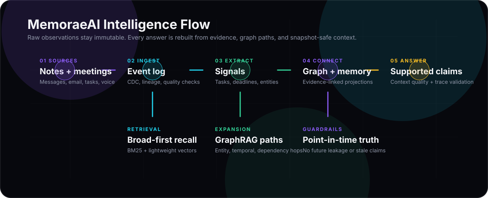
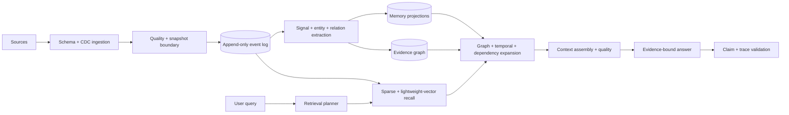

<p align="center">
  
</p>

<h1 align="center">MemoraeAI</h1>

<p align="center">
  <strong>An evidence-first Personal Intelligence OS for the things scattered across your work and life.</strong>
</p>

<p align="center">
  MemoraeAI turns messages, notes, calendar events, meetings, voice notes, tasks, decisions, preferences, relationships, and project history into a queryable memory graph with traceable answers.
</p>

<p align="center">
  
</p>

<p align="center">
  <a href="#what-it-does">What It Does</a> |
  <a href="#architecture">Architecture</a> |
  <a href="#design-principles">Design</a> |
  <a href="#evaluation">Evaluation</a> |
  <a href="#quick-start">Quick Start</a>
</p>

## What It Does

MemoraeAI is not a chat wrapper over transcripts. It is a small but complete personal intelligence platform that keeps raw observations immutable, derives structured memory from them, connects that memory in a knowledge graph, and answers questions only from selected evidence.

| Layer | What it adds |
|---|---|
| Event ingestion | Normalizes messages, notes, calendar items, tasks, voice transcripts, and meeting records into timestamped observations. |
| Data engineering | Tracks CDC operations, lineage, checksums, schema quality, duplicate detection, and snapshot boundaries. |
| Memory projections | Builds episodic, commitment, project, semantic, relationship, preference, interaction, temporal, activity, decision, meeting, goal, and learning views. |
| Knowledge graph | Links people, projects, tasks, meetings, decisions, deadlines, documents, risks, dependencies, preferences, and raw events. |
| GraphRAG retrieval | Starts every query with broad recall, then expands through graph, temporal, project, entity, and dependency paths. |
| Evidence answers | Produces supported claims with context quality, provenance, and trace validation instead of loose summaries. |
| Web workspace | Provides a dark-first Next.js interface for intelligence brief, AI workspace, memory explorer, graph, timeline, voice, meetings, projects, and analytics. |

## Product Feel

The frontend is designed like an operating surface, not a landing page. The first screen is the actual intelligence dashboard: current priorities, risks, graph health, project movement, timeline changes, and a command center for asking questions across memory.

Design choices include:

- a compact left navigation for repeated daily use;
- glass panels, low-contrast grids, and luminous graph imagery for a premium intelligence feel;
- dense, scan-friendly cards instead of oversized marketing sections;
- icon-led navigation and actions using `lucide-react`;
- a custom MemoraeAI mark, favicon, and intelligence-map banner under `frontend/public/brand`.

## Architecture

<p align="center">
  
</p>

MemoraeAI is modular in-process today, but the boundaries map cleanly to production services later: ingestion workers, queues, sparse/vector indexes, graph storage, materialized memory stores, and query orchestration.



Important architecture details from [Platform Architecture](docs/PLATFORM_ARCHITECTURE.md):

- Raw event history is append-only. Corrections and deletes are new observations, not silent rewrites.
- `observed_at`, `occurred_at`, meeting time, and deadline time are separate, so answers can stay point-in-time accurate.
- Every derived node and edge carries raw evidence IDs and confidence.
- Recency is a tie-breaker, not a truth signal; old evidence remains discoverable for history and corrections.
- Runtime storage defaults to project-local `storage/`, keeping logs, indexes, uploads, generated files, caches, and databases out of the source tree.
- Media workflows rely on hosted transcription contracts or supplied transcripts, avoiding heavyweight local speech-model downloads.

## Design Principles

The core design invariants are summarized in [Design Reference](docs/DESIGN.md):

| Principle | Why it matters |
|---|---|
| Immutable observations | The system can explain how it knew something at a specific time. |
| Evidence-linked intelligence | Every memory, graph node, edge, and answer can resolve back to source events. |
| Broad-first retrieval | The query engine avoids prematurely choosing one memory layer and missing relevant evidence. |
| Projection-guided expansion | Memory views guide graph expansion only after evidence has been discovered. |
| Quality-visible answers | Context quality, provenance, and claim validation are surfaced instead of hidden. |
| Optional hosted APIs | The base system runs without heavyweight local models; hosted APIs can improve media and embedding quality. |
| Project-local runtime data | Mutable data stays under `storage/` and is ignored by Git. |

## Evaluation

MemoraeAI is evaluated as a connected data, graph, retrieval, context, and answer system. A fluent answer is not enough: it fails if evidence discovery missed required facts, graph links are wrong, temporal state is stale, or claims lack provenance.

The evaluation plan in [Evaluation Framework](docs/EVALUATION.md) covers:

- schema validity, duplicate rate, lineage coverage, cursor continuity, and future leakage;
- entity precision/recall, alias accuracy, ambiguity calibration, and relationship provenance;
- task and commitment extraction, deadline accuracy, and current-state accuracy;
- broad recall, expansion gain, reranking quality, dependency paths, and temporal change chains;
- context coverage, redundancy control, stale-as-current rate, and quality calibration;
- answer faithfulness, claim support coverage, incomplete-evidence disclosure, and trace validity.

Regression cases are designed around hard personal-memory problems: renamed projects, conflicting updates, old evidence versus recent distractors, dependencies requiring two-hop traversal, post-snapshot observations, and paraphrased questions about risk, ownership, blockers, and history.

## Demo Snapshot

The included sample data lives in [data/memorae_mock_events.json](data/memorae_mock_events.json). It is anchored around `2026-08-13` and includes past notes, corrected deadlines, near-future meetings, personal reminders, project risks, and workplace commitments for Shashank.

Try:

```text
What should I focus on today?
Who are we waiting on?
What changed about the licensing estimate?
Summarize everything related to the UIE proposal.
Which obligation is most likely to slip?
```

## Quick Start

Backend:

```powershell
python -B run.py --query "Who are we waiting on?"
python -B run.py --query "What changed about the licensing estimate?" --trace
python -B run.py --demo
python -B run.py --snapshot
```

Frontend:

```powershell
cd frontend
npm install
npm run dev
```

Open the local URL printed by Next.js. If port `3000` is busy, Next will choose another available port.

## Repository Map

```text
app/
  agents/              workflow and goal planners
  data_engineering/    CDC, lineage, contracts, quality, lake zones
  graph/               entity extraction, relationships, traversal, storage
  ingestion/           event loading and source normalization
  media/               hosted transcription, voice, and video pipelines
  memory/              evidence-linked memory projections
  observability/       query audit logs and command-output logs
  presentation/        terminal response rendering
  reasoning/           context assembly, answer synthesis, validation
  retrieval/           BM25, hashing embeddings, expansion, GraphRAG
  evaluation/          graph, retrieval, context, evidence, trace metrics

frontend/
  app/                 Next.js routes and API handlers
  components/          dashboard, command center, graph, shell, charts
  lib/                 API contracts, storage helpers, utilities
  public/brand/        logo, favicon, README/app visuals
  store/               Zustand UI state

docs/
  DESIGN.md
  EVALUATION.md
  PLATFORM_ARCHITECTURE.md
  OPERATING_SYSTEM_BLUEPRINT.md
```

## Runtime Storage

Runtime files are intentionally ignored by Git. MemoraeAI creates them under `storage/`:

```text
storage/
  artifacts/   generated manifests and command artifacts
  cache/       bounded query/context caches
  database/    application databases
  embeddings/  optional cached embedding responses
  exports/     user exports and reports
  generated/   generated files
  graph/       graph databases
  indexes/     sparse and vector indexes
  lake/        raw and processed data zones
  logs/        platform logs and query audit traces
  models/      redirected model/package caches
  sqlite/      portable snapshots
  temp/        controlled temporary files
  uploads/     pasted or uploaded frontend data
```

## Roadmap

- Normalize person, project, and document aliases with ambiguity states.
- Add reproducible labeled-case evaluation runners.
- Persist explicit support, contradiction, completion, and supersession edges.
- Add webhook-based hosted transcription completion.
- Introduce incremental project communities and learned reranking.
- Add calendar, email, task-manager, and note connectors with deletion propagation.

For the deeper product and scale plan, see [Operating System Blueprint](docs/OPERATING_SYSTEM_BLUEPRINT.md).
