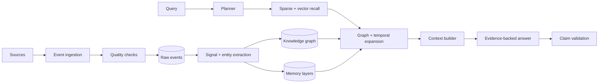

<p align="center">
  
</p>

<h1 align="center">MemoraeAI</h1>

<p align="center">
  Evidence-first personal intelligence for notes, tasks, meetings, relationships, preferences, projects, and decisions.
</p>

<p align="center">
  
</p>

## Highlights

- Builds memory layers for episodes, commitments, projects, semantic facts, decisions, meetings, goals, preferences, relationships, and learnings.
- Turns raw events into traceable knowledge graph nodes and edges.
- Answers questions with GraphRAG retrieval, context-quality scoring, and evidence validation.
- Keeps old facts for history while resolving the latest deadline, blocker, or decision.
- Ships with a polished Next.js workspace for dashboard, memory, graph, timeline, voice, meetings, projects, and analytics.
- Runs offline by default with BM25 and deterministic hashing embeddings.

## Demo Snapshot

The sample data is recent and anchored around `2026-08-13`, with a mix of past notes and near-future commitments for Shashank.

Try questions like:

```text
What should I focus on today?
Who are we waiting on?
What changed about the licensing estimate?
Summarize everything related to the UIE proposal.
```

## Quick Start

Backend:

```powershell
python -m pytest
python -B run.py --query "Who are we waiting on?"
python -B run.py --query "What changed about the licensing estimate?" --trace
```

Frontend:

```powershell
cd frontend
npm install
npm run dev
```

Open the local URL printed by Next.js. If port `3000` is busy, Next will use the next available port.

## Project Layout

```text
app/
  agents/              workflow and goal planners
  data_engineering/    CDC, lineage, contracts, quality, lake zones
  graph/               entity extraction, relationship extraction, graph store
  ingestion/           event loading and source normalization
  media/               hosted transcription, voice, and video pipelines
  memory/              evidence-linked memory projections
  observability/       query audit logs and terminal run logs
  reasoning/           context assembly, answer synthesis, validation
  retrieval/           BM25, hashing embeddings, expansion, GraphRAG
  evaluation/          retrieval, graph, context, and trace metrics

data/
  memorae_mock_events.json

frontend/
  app/                 Next.js routes and API handlers
  components/          dashboard, command center, graph, charts, shell
  lib/                 client/server helpers and API contracts
  public/brand/        Memorae visual assets
  store/               Zustand UI state

tests/
  backend behavior, retrieval, graph, temporal reasoning, and observability
```

## Architecture



## Runtime Storage

Runtime files are created under `storage/` and are intentionally ignored by Git:

```text
storage/
  cache/
  logs/
  uploads/
  generated/
  sqlite/
  graph/
  models/
```

This keeps the repository focused on source, tests, docs, sample data, and visual assets.

## Quality Checks

```powershell
python -m pytest
cd frontend
npm run typecheck
```

Current local verification:

```text
37 backend tests passing
frontend typecheck passing
```
