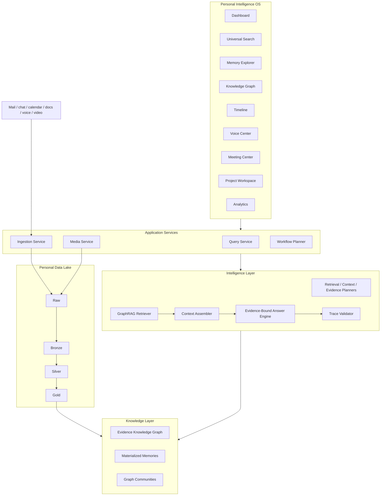
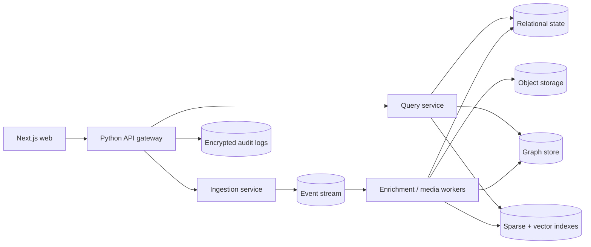

# Memorae Personal Intelligence OS Blueprint

This document maps the repository to the venture-scale product direction: a Personal Intelligence Operating System that combines memory, GraphRAG, knowledge graphs, data engineering, voice/video intelligence, explainable AI, and a modern web workspace.

## 1. Complete architecture redesign



The implemented backend is evidence-first: broad recall happens before memory-layer selection, derived graph nodes retain source event IDs, and answers are validated against selected evidence.

## 2. Updated folder structure

```text
app/
  agents/              goal, task, evidence, context, workflow planners
  data_engineering/    CDC, lake zones, stream/batch contracts, lineage, quality
  evaluation/          retrieval, graph, context, evidence, trace metrics
  graph/               entity extraction, relationships, graph traversal, graph store
  ingestion/           source normalization and point-in-time loading
  media/               API-only voice/video transcription pipelines
  memory/              episodic, commitment, project, semantic, preference,
                       relationship, activity, decision, meeting, goal, learning
  observability/       platform logs, query audit logs, command-output artifacts
  presentation/        user-friendly terminal output
  reasoning/           signal extraction, context assembly, answers, validation
  retrieval/           broad recall, planner, expansion, memory router, GraphRAG
  utils/               text and time primitives

frontend/
  app/                 dashboard, memory, graph, timeline, voice, meetings,
                       projects, analytics
  components/          shell, cards, graph, charts, workspace lists
  lib/                 API contracts, seeded product data, utilities
  store/               Zustand interaction state
```

## 3. GraphRAG architecture

```text
Query
  -> entity and facet detection
  -> broad sparse/lightweight-vector recall over raw events
  -> anchor events/entities
  -> graph, temporal, dependency, and entity expansion
  -> candidate reranking
  -> context-quality scoring
  -> compact evidence bundle
  -> answer with validated claims
  -> full retrieval trace stored in audit logs
```

The retrieval planner does not assume where the answer lives. It starts from evidence recall and only then decides which memory views are useful.

## 4. Knowledge graph schema

Core nodes:

- `Event`
- `Person`
- `Project`
- `Task`
- `Meeting`
- `Goal`
- `Decision`
- `Risk`
- `Organization`
- `Document`
- `Topic`
- `Deadline`
- `Dependency`
- `Preference`
- `Learning`

Core edges:

```text
Person    -owns--------------> Task
Person    -collaborates_with-> Person
Task      -belongs_to--------> Project
Task      -depends_on--------> Task / Dependency
Task      -blocked_by--------> Dependency
Meeting   -discusses---------> Project
Decision  -impacts-----------> Project / Task
Project   -has_risk----------> Risk
Event     -evidence_for------> Derived node
Event     -mentions----------> Entity
Event     -supersedes--------> Prior event / claim
Event     -completes---------> Task / event
Event     -temporally_adjacent-> Event
```

Every derived node and edge must carry evidence IDs and confidence. Raw events and graph storage remain separate.

## 5. Data engineering architecture

Memorae uses a medallion-style personal data lake:

```text
Raw -> Bronze -> Silver -> Gold -> Knowledge -> Intelligence
```

- Raw: immutable source artifacts, media references, cursors, checksums.
- Bronze: canonical `EventEnvelope` records with CDC operations.
- Silver: normalized people, projects, meetings, decisions, deadlines, tasks, and relationships.
- Gold: materialized memory views and project/commitment state.
- Knowledge: graph nodes, edges, communities, transitions, evidence links.
- Intelligence: briefs, workflow proposals, answers, quality scores, traces.

Implemented foundations include event envelopes, source IDs, CDC operations, data-quality checks, lineage records, checkpoints, and snapshot isolation based on `observed_at`.

## 6. Voice AI architecture

```text
Voice note / call audio
  -> supplied transcript or hosted STT provider
  -> speaker-aware transcript
  -> event envelopes
  -> action/deadline/blocker/decision extraction
  -> graph update
  -> memory update
  -> voice workspace
```

Supported design constraints:

- Hosted APIs only: Deepgram, AssemblyAI, Whisper API.
- No local speech models.
- No local media-model cache.
- If no API is configured, store a pending media reference or use a user-supplied transcript.

## 7. Video AI architecture

```text
Zoom / Meet / Teams / MP4
  -> provider-managed audio extraction
  -> transcription
  -> event envelopes
  -> entity and relationship extraction
  -> graph update
  -> meeting memory update
  -> meeting workspace
```

The local application should not run ffmpeg-heavy pipelines by default. Production video jobs should run as remote/background media tasks with signed URLs and explicit retention controls.

## 8. Agentic workflow architecture

Planners are evidence-bound and non-destructive by default:

- Retrieval Planner: decides recall breadth, expansion depth, and stopping.
- Context Planner: builds compact task/project/decision/risk context.
- Evidence Planner: identifies unsupported or weak plan areas.
- Task Planner: ranks tasks and preserves dependencies.
- Goal Planner: finds graph-connected goals, risks, and next steps.
- Workflow Planner: proposes a plan for user approval.

```text
Goal -> Goal Planner -> Evidence Planner -> Context Planner
     -> Task Planner -> Workflow Planner -> User Review
     -> explicit approval -> external action adapter
```

No planner silently sends emails, schedules meetings, or mutates external systems.

## 9. Context engineering redesign

Context is selected as an evidence bundle, not as a prompt dump.

Required signals:

- evidence coverage
- entity/source diversity
- completeness
- temporal accuracy
- graph coverage
- contradiction and correction handling
- redundancy control
- token budget fit

Mandatory context types:

- strongest direct evidence
- latest current-state support
- correction/supersession history
- direct blockers and dependencies
- relevant temporal neighbors
- graph paths needed to explain the answer

## 10. Retrieval redesign

The current retrieval direction is evidence-driven:

```text
Broad recall -> evidence anchors -> expansion -> rerank -> context -> answer
```

Design rules:

- Do not hard-route a query to a single memory type before retrieval.
- Search raw evidence first.
- Use graph expansion when entity/project/relationship anchors emerge.
- Use temporal expansion around important events.
- Use dependency expansion for blockers, commitments, and project risk.
- Stop when marginal evidence gain falls below the retrieval plan threshold or bounded rounds are exhausted.

## 11. Storage redesign

Default storage root:

```text
personal-intelligence-platform\storage\
  embeddings\
  sqlite\
  database\
  graph\
  indexes\
  lake\
  temp\
  cache\
  uploads\
  exports\
  models\
  artifacts\
  generated\
  logs\
```

Do not create root-level D drive folders. Do not use `C:\Users`, AppData, HuggingFace cache, Ollama, or local LLM model folders for platform runtime storage. Redirect package/model caches inside project-local `storage\models`.

Logs:

```text
logs\
  platform.log
  query-audit-YYYY-MM-DD.jsonl
  command-output-YYYYMMDD-HHMMSS-<id>.json
```

Terminal output stays readable. Full GraphRAG traces, candidate IDs, expansion paths, selected evidence, raw answers, and the exact terminal output are persisted in logs.

## 12. UI information architecture

| Workspace | Job |
|---|---|
| Intelligence Dashboard | Show today’s priorities, risks, commitments, project health, and briefs. |
| Memory Explorer | Browse tasks, decisions, meetings, notes, conversations, preferences. |
| Knowledge Graph | Explore people, projects, decisions, risks, dependencies, documents. |
| Timeline Intelligence | Reconstruct changes, project evolution, commitments, meetings. |
| Voice Intelligence | Upload/record audio, review transcript, action items, reminders. |
| Meeting Intelligence | Review summaries, decisions, risks, owners, unresolved follow-ups. |
| Project Workspace | Inspect project graph, risks, blockers, dependencies, health. |
| Analytics Center | Show completion trends, productivity, meeting load, drift, health. |

The home page is not a ChatGPT clone. It is an operating picture with search as a command surface.

## 13. UI wireframes

Dashboard:

```text
+----------------+---------------------------------------------------+
| MEMORAE        | Search memory...                       Synced 2m   |
|----------------+---------------------------------------------------|
| Intelligence   | Good evening. Your operating picture              |
| Memory         | [Priorities] [Risks] [Commitments] [Projects]     |
| Graph          |                                                   |
| Timeline       | Today's brief              Living timeline        |
| Voice          | 1. Finish proposal         08:30 blocker found     |
| Meetings       | 2. Resolve diagrams        09:10 deadline moved    |
| Projects       | 3. Send redlines           10:20 owner changed     |
| Analytics      |                                                   |
+----------------+---------------------------------------------------+
```

Project workspace:

```text
+--------------------+---------------------+------------------------+
| Project health     | Risks / blockers    | Commitments            |
| 68% - drifting     | diagrams block flow | proposal due 15:00     |
+--------------------+---------------------+------------------------+
| Project graph: people -> tasks -> dependencies                     |
| Decision and activity timeline: old claim -> correction -> current |
+-------------------------------------------------------------------+
```

## 14. Component hierarchy

```text
RootLayout
  Providers
    AppShell
      SidebarNavigation
      UniversalSearchTrigger
      WorkspacePage
        Dashboard
        MemoryExplorer
        KnowledgeGraph
        Timeline
        VoiceCenter
        MeetingCenter
        ProjectWorkspace
        AnalyticsCenter
        PageHeading / Card / Badge / Chart / GraphNode
```

Zustand owns ephemeral UI state. TanStack Query owns server state. React Flow owns graph interactions. Recharts owns analytics visualizations.

## 15. User journeys

- Morning brief: open dashboard -> inspect risks -> open blocker evidence -> approve next-step workflow.
- Meeting capture: upload recording -> hosted transcription -> review owners -> approve graph/memory updates.
- Explain a change: open timeline -> compare old/new claims -> inspect graph neighbors -> export supported summary.
- Goal planning: enter goal -> discover related work and risks -> review evidence gaps -> approve workflow.
- Voice note: record idea -> transcript -> extracted tasks/decisions -> memory update.

## 16. File-by-file migration plan

| Area | Current foundation | Next production migration |
|---|---|---|
| `app/ingestion/*` | JSON source loader, envelopes, lineage | source connector registry, tombstones, sync cursors |
| `app/data_engineering/*` | CDC, contracts, quality, lake zones | Parquet/object storage, schema registry, stream runtime |
| `app/graph/*` | typed evidence graph, SQLite graph store | bitemporal claims, user corrections, incremental communities |
| `app/memory/*` | evidence-linked memory projections | durable incremental projections and correction UI |
| `app/retrieval/*` | GraphRAG planner, expansion, rerank | ANN service, learned reranker, deep-search mode |
| `app/reasoning/*` | answer/context/trace validation | answer style adapters, contradiction UX, calibrated abstention |
| `app/media/*` | Deepgram-style provider and fallback | AssemblyAI/Whisper adapters, webhooks, speaker review |
| `app/agents/*` | evidence-backed workflow proposals | action adapters with explicit approval |
| `app/observability/*` | audit logs and command artifacts | encryption, redaction, retention, metrics sink |
| `frontend/*` | OS workspace scaffold | live API, uploads, accessibility, responsive QA |

## 17. Scalability strategy

- Partition lake, indexes, and graph snapshots by tenant, source, and time.
- Keep raw evidence immutable and compress cold zones.
- Maintain incremental graph/community updates instead of full rebuilds.
- Separate hot memory state from archival evidence.
- Cache evidence bundles by query, snapshot, permissions, and index version.
- Bound candidates, hops, expansion rounds, graph nodes, and context tokens.
- Move retrieval/index services behind APIs when data volume exceeds local limits.

## 18. Evaluation framework

Evaluate by layer:

- data contracts and schema validation
- lineage completeness
- task/commitment extraction
- entity resolution accuracy
- relationship extraction and graph quality
- broad recall, expanded recall gain, nDCG, reciprocal rank
- temporal/dependency path recovery
- context evidence coverage and compactness
- answer faithfulness and hallucination rate
- reasoning trace validity
- unknown-query robustness across aliases, projects, and phrasing families

All benchmark runs should store dataset hash, code version, snapshot time, index version, model/API version, retrieval trace, and answer artifact.

## 19. Production deployment plan



Production requirements:

- tenant isolation
- encryption at rest and in transit
- secrets management
- signed media URLs
- permissions and source-level ACLs
- rate limits
- backup and restore drills
- deletion propagation
- observability dashboards
- audit-log retention controls

## 20. Future roadmap

1. Durable API and source connector layer.
2. User-editable entity resolution and graph corrections.
3. Evidence-linked daily briefs and weekly executive summaries.
4. Provider choice, media job webhooks, speaker identity review.
5. MCP-compatible tools with explicit action approval.
6. Personal research assistant and personal search engine.
7. Personal CRM, autonomous follow-up drafts, and scheduling suggestions.
8. Goal, habit, focus, learning, and burnout insights with opt-in safeguards.
9. Multi-agent collaboration with shared evidence and authorization.
10. Encrypted multi-device sync and life-timeline reconstruction.
