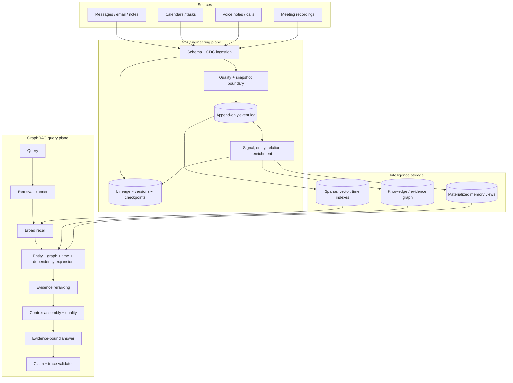
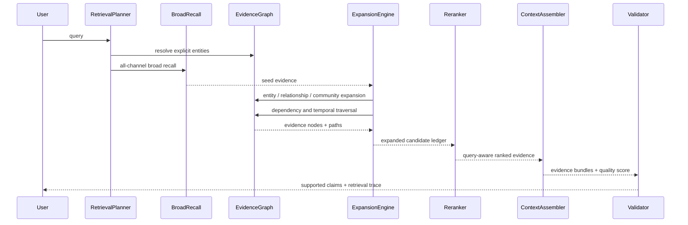
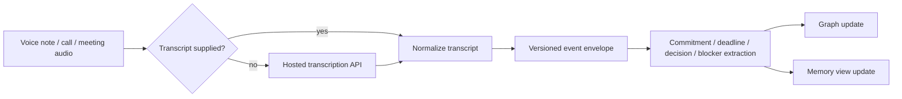
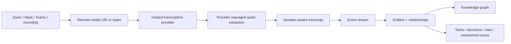

# Memorae Platform Architecture

## 1. Product architecture

Memorae is a personal intelligence layer, not a chat wrapper over a transcript. Raw observations enter an event-sourced pipeline, derived intelligence is stored as evidence-linked materialized views and graph nodes, and every query starts with broad evidence discovery.



The system is modular in-process today. Its interfaces deliberately map to queues, search services, graph stores, and workers when scale requires them.

## 2. Folder structure

```text
app/
  data_engineering/
    models.py          # EventEnvelope, CDCOperation, LineageRecord
    quality.py         # schema/snapshot/duplicate monitoring
    pipeline.py        # checkpoints and incremental view updates
  ingestion/
    loader.py          # source normalization and raw-to-event lineage
  graph/
    models.py          # node and relation schema
    evidence.py        # graph traversal and community discovery
    extraction.py      # entities, relationships, temporal edges
    store.py           # normalized graph SQLite
  memory/
    episodic.py        # immutable raw event view
    commitment.py      # commitment lifecycle projection
    project.py         # topic/project projection
    semantic.py        # evidence-linked semantic projection
    relationship.py    # person relationship view
    preference.py      # preference view
    interaction.py     # source/participant interaction view
    temporal_event.py  # timeline reconstruction
    activity.py        # tasks, meetings, decisions, risks
  retrieval/
    bm25.py            # sparse recall
    embeddings.py      # feature hashing or remote API embeddings
    hybrid.py          # broad evidence recall
    planner.py         # soft constraints and completeness
    memory_router.py   # post-evidence projection selection
    expansion.py       # graph/time/dependency evidence discovery
    graphrag.py        # iterative orchestration and trace
  reasoning/
    extraction.py      # explainable event signals
    evidence_context.py
    context_quality.py
    query_engine.py    # supported-claim construction
    trace_validation.py
  media/
    transcription.py   # remote provider contract
    voice.py           # voice note/audio/call ingestion
    video.py           # provider-managed video transcription
  evaluation/
    metrics.py         # graph, retrieval, context, evidence, trace metrics
  main.py              # composition root
```

## 3. Data engineering architecture

### Event sourcing and CDC

Every observation is an `EventEnvelope` with a source ID, stable platform ID, operation, schema version, observation time, occurrence time, source cursor, checksum, metadata, and trace ID. `UPSERT` and `DELETE` are explicit CDC operations. The raw event log is append-only; deletes and corrections create new observations rather than rewriting history.

### Incremental processing

`IncrementalEventProcessor` maintains processed checksums and per-source cursors. Registered materialized views receive only unseen envelopes. Each view update returns output IDs, producing a `LineageRecord` from source event to derived object.

### Temporal snapshots

Snapshot isolation uses `observed_at`: information learned after `as_of` cannot enter an answer. `occurred_at`, meeting time, and deadline time are separate domain values, so a future meeting learned today remains valid evidence.

### Data quality

The quality monitor checks required fields, snapshot leakage, duplicate envelopes, source identity, and schema consistency. Production monitoring adds source lag, cursor gaps, parse failure, unexpectedly empty streams, graph orphan rates, and materialized-view drift.

### Versioning and lineage

Event schema, extractor, processor, retrieval document, graph builder, and answer trace versions must be persisted. An answer is reproducible from:

```text
query + snapshot + raw event IDs + processor/index versions + retrieval trace
```

## 4. GraphRAG architecture



`RetrievalPlanner` extracts soft facets such as entity names, requested relationships, completeness, and time language. It never chooses one exclusive query route. `MemoryRouter` runs after seed evidence exists and makes projection expansion explainable.

Community detection currently uses deterministic graph components for inspection. At scale, replace this implementation with incremental Leiden/Louvain communities while retaining membership confidence, version, and supporting edges.

## 5. Knowledge graph schema

### Nodes

| Node | Examples | Provenance |
|---|---|---|
| Person | collaborator, family member, customer | mention spans and source events |
| Project | named initiative or discovered topic | entity mentions and topic membership |
| Task | requested or promised action | task/commitment evidence |
| Meeting | calendar or explicit scheduled interaction | event and occurrence time |
| Decision | correction, approval, choice, changed date/value | decision evidence and validity |
| Deadline | normalized date/time | temporal mention span |
| Organization | employer, customer, vendor | entity mentions |
| Document | proposal, SOW, report, checklist, appendix | document mention |
| Risk | delay, overdue state, unresolved problem | evidence and risk score |
| Dependency | blocker or prerequisite | dependency phrase and linked action |
| Preference | stable expressed preference | preference observation |
| Event | immutable source observation | canonical event ID |

### Edges

```text
Person       -OWNS----------> Task
Task         -BELONGS_TO----> Project
Task         -DEPENDS_ON----> Task/Dependency
Task         -BLOCKED_BY----> Dependency
Meeting      -DISCUSSES-----> Project
Project      -CONTAINS------> Decision
Decision     -IMPACTS-------> Task
Task/Meeting -HAS_DEADLINE--> Deadline
Task         -HAS_RISK------> Risk
Event        -EVIDENCE_FOR--> Derived node
Claim        -SUPERSEDES----> Prior claim
Event        -TEMPORALLY_ADJACENT-> Event
```

Every derived node and edge carries raw evidence IDs and confidence. The graph is stored separately from raw event tables so graph rebuilds cannot corrupt source history.

## 6. Voice intelligence workflow



`VoicePipeline` supports raw bytes, a remote media URI, or a supplied transcript. Without an API or transcript it returns `pending_transcription` rather than failing or downloading a model. Deepgram is implemented through the provider contract; AssemblyAI or OpenAI adapters can implement the same two-method interface.

## 7. Video intelligence workflow



Memorae does not run local speech models or local media extraction. This avoids model downloads, ffmpeg caches, and large duplicate media files. Source media can remain in the originating provider with URI, checksum, access policy, and retention metadata.

## 8. Retrieval redesign

1. **Broad recall:** BM25 and lightweight vector relevance run over raw evidence for every query.
2. **Entity discovery:** explicit aliases seed graph entities; recalled evidence contributes additional entity anchors.
3. **Evidence expansion:** bounded graph, temporal-neighbor, project/entity, and dependency traversal adds candidates with relation paths.
4. **Evidence reranking:** relevance, lexical coverage, requested relation match, graph support, and task priority features are combined transparently.
5. **Dynamic memory selection:** projection layers are chosen from discovered graph node types.
6. **Stopping:** frontier exhaustion, two low-gain rounds, maximum rounds, or hard budgets stop retrieval.

Recency is a small broad-recall tie-breaker, not a universal truth signal. Old evidence remains discoverable for history, corrections, and long-running commitments.

For production scale, BM25 moves to OpenSearch/Tantivy, remote vectors to a tenant-scoped ANN service, and the candidate ledger remains application-level so all provenance survives fusion.

## 9. Context engineering

`EvidenceContextAssembler` selects evidence by marginal utility rather than score alone:

```text
utility = relevance + query coverage + source diversity - redundancy
```

Each selected event is packaged with linked graph nodes and expansion paths. Corrections are preserved as history instead of being deleted. The context-quality score reports:

- evidence coverage;
- source diversity;
- recency;
- completeness relative to query scope;
- contradiction-resolution evidence.

Answer construction reads only selected graph/evidence nodes. `ReasoningTraceValidator` checks that broad recall occurred, every claim has selected raw evidence, snapshot boundaries hold, and no trace invents an unexecuted route.

## 10. File-by-file migration status

| Area | Implemented foundation | Next production migration |
|---|---|---|
| `config.py` | Central D-drive layout and low-footprint settings | secrets provider, per-tenant quotas, retention policy |
| `data_engineering/*` | CDC envelopes, checksums, quality, checkpoints, lineage | durable stream/queue, dead-letter topic, schema registry |
| `ingestion/loader.py` | observation/occurrence separation and trace IDs | source-specific connectors and deletion propagation |
| `graph/*` | typed graph, extraction, traversal, communities, SQLite | contextual entity model, bitemporal claims, incremental Leiden |
| `memory/*` | nine memory projections | event-sourced commitment projector and multi-label projects |
| `retrieval/*` | planner, broad recall, graph/time/dependency expansion, rerank, trace | ANN/sparse services, learned reranker, calibrated stop estimator |
| `reasoning/*` | graph context, quality score, supported claims, validation | claim normalization, explicit support/contradiction bundles |
| `media/*` | Deepgram adapter, sidecar fallback, voice/video pipelines | additional hosted providers, webhook completion, speaker identity |
| `evaluation/metrics.py` | graph, recall, ranking, expansion, context, evidence, trace metrics | labeled benchmark runner and continuous slice dashboard |
| `memory/store.py` | transactional memory snapshot | normalized bitemporal tables and migration framework |
| `main.py` | in-process composition | asynchronous workers and service boundaries |

## 11. Storage design

All mutable platform data defaults to the repository-local `storage` directory:

```text
personal-intelligence-platform\storage\
  sqlite\       # raw events, projections, checkpoints, lineage
  database\     # application databases
  graph\        # graph database / graph SQLite
  indexes\      # sparse and ANN indexes
  embeddings\   # remote embedding responses when caching is enabled
  cache\        # bounded query/context caches
  temp\         # controlled temporary files
  uploads\      # frontend uploads and pasted data
  exports\      # user exports and reports
  models\       # redirected package/model caches
  artifacts\    # manifests and command artifacts
  generated\    # generated files
  logs\         # structured operational and audit logs
```

The runtime does not initialize Hugging Face, Ollama, or local model caches. `prepare_runtime_storage()` explicitly redirects temporary, general cache, Hugging Face, Transformers, SentenceTransformers, and Torch cache variables into project storage. Media providers should receive streams or remote URIs; temporary media must be encrypted, bounded, and deleted after processing.

Recommended policies:

- content-addressed deduplication for attachments;
- configurable TTLs for remote embedding and transcript caches;
- append-only raw event partitions by tenant/year/month;
- hot/cold split for recent indexes versus archived history;
- encryption at rest and per-user graph/index namespaces;
- deletion tombstones propagated to projections, graph, indexes, and caches.

## 12. Scalability plan

### One million events

- partition raw events and sparse indexes by tenant and time;
- batch remote embeddings and cache by content hash/model version;
- maintain recent and archival ANN tiers;
- precompute event/entity adjacency lists;
- stream incremental projection and graph deltas;
- avoid whole-corpus project reclustering.

### One hundred thousand tasks

- materialize active-state, deadline, owner, risk, and dependency indexes;
- keep complete state transitions in cold history;
- update only commitments touched by new evidence;
- maintain dependency reverse edges for impact analysis.

### Ten thousand projects and years of history

- allow multi-project membership with confidence;
- maintain hierarchical daily, weekly, and project claim summaries with evidence hashes;
- detect communities incrementally;
- query hot recent partitions first, then expand to archival partitions when coverage is low;
- cache evidence bundles by query fingerprint, snapshot, and index versions.

The synchronous query budget should cap recalled IDs, graph nodes, hops, token cost, and expansion rounds. A slower deep-search mode can raise those limits explicitly.

## 13. Evaluation framework

Evaluation uses point-in-time cases with gold evidence IDs, entities, relationships, required facets, temporal chains, dependency paths, and supported claims.

| Layer | Metrics |
|---|---|
| Ingestion | schema validity, duplicate rate, cursor gaps, lineage coverage, snapshot leakage |
| Entity graph | entity precision/recall, resolution accuracy, edge precision/recall, orphan rate, provenance coverage |
| Tasks/memory | task and commitment precision/recall, deadline accuracy, lifecycle-state accuracy |
| Retrieval | broad Recall@K, expanded Recall@K, expansion gain/precision, MRR, nDCG |
| Temporal/dependency | change-chain recall, temporal accuracy, dependency-path recall |
| Context | evidence/facet coverage, evidence density, redundancy, stale-as-current rate, quality calibration |
| Answer | claim support coverage, faithfulness, hallucination rate, incomplete-evidence disclosure |
| Trace | provenance validity, executed-route accuracy, stop consistency, future-evidence violations |

Unknown-query evaluation must hold out projects, aliases, and phrasing families. Recent high-importance distractors and conflicting evidence are required hard negatives.

## 14. Roadmap

### Near term

- Normalize person/project/document aliases with ambiguity states.
- Persist event envelopes, lineage, checkpoints, and graph under the centralized layout.
- Add gold query cases and a reproducible evaluation runner.
- Add explicit support, contradiction, completion, and supersession edges.
- Add webhook-based hosted transcription completion.

### Medium term

- Incremental multi-label project communities.
- Learned non-generative reranker trained on hard negatives and user corrections.
- Evidence-linked hierarchical summaries.
- Calendar, email, task-manager, and note connectors with deletion propagation.
- Speaker identity and meeting-level decision/action review.

### Long term

- Multi-device encrypted synchronization.
- User-editable graph and memory corrections.
- Proactive intelligence constrained by confidence, sensitivity, and interruption budgets.
- Voice-first query and response experience.
- Federated/private evaluation and per-user ranking adaptation.
